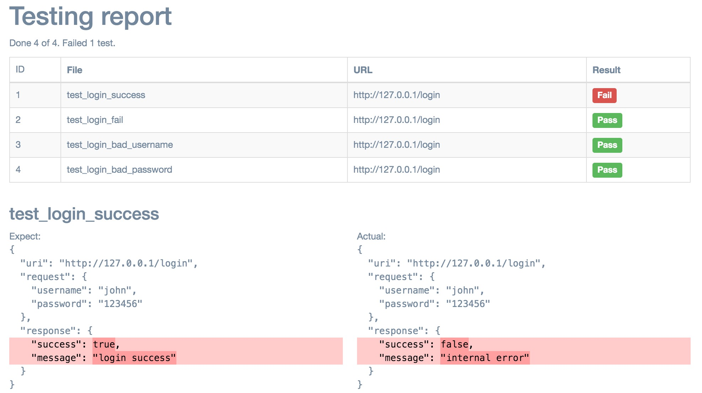

# jsontest

An API testing tool for human.

In progressing...

## Examples

Write test cases in human json.

``` hjson
{
    request: {
        url: http://127.0.0.1:8000/login_success
    }
    response: {
        body: {
            success: true
            message: login success
        }
    }
}
```

View testing report. Highlight bad assertions.



## Tutorial

### Basics

Put the following test case into a file.

``` hjson
# This is a simple test case
{
    # Reuqest the url: http://127.0.0.1:8000/login_success
    request: {
        url: http://127.0.0.1:8000/login_success
    }

    # Expected response is the following json:
    # {
    #    "success":true,
    #    "message":"login success"
    # }
    response: {
        body: {
            success: true
            message: login success
        }
    }
}
```

Suppose the file name is `helloworld.jsontest`, then you can run the test case use
the fowllowing command:

``` bash
python jsontest.py helloworld.jsontest
```

It will give the output:

``` plain
Passed: test/cases/01_request/test_not_found

Total 1
Passed 1
Failed 0
Error 0
```

### Handling error

The response has a `status` field if target url not returning 200 ok.
In this way, you can check the status code.

``` hjson
{
    request: {
        url: http://127.0.0.1:8000/bad_url
    }
    response: {
        status: "404"
        body: {
            success: false
            message: request path not found
        }
    }
}
```

### Variable

You can define variables for better maintenance.

``` hjson
{
    var: {
        # define a target variable
        target: http://127.0.0.1:8000
    }
    request: {
        # ${target} to use the variable
        url: ${target}/login_success
    }
    response: {
        body: {
            success: true
            message: login success
        }
    }
}
```
